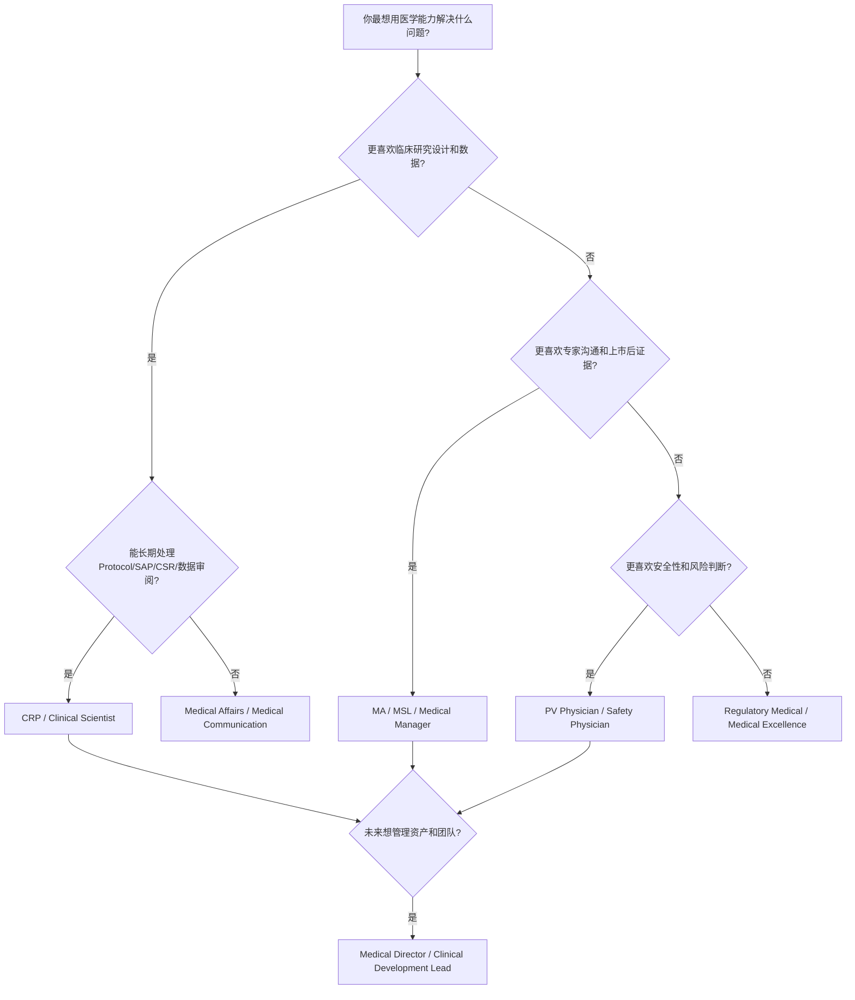

id: career-navigator

# Career Navigator：从医生到药企医学岗位的职业决策树

## 先回答一个核心问题

职业转型不是“哪个岗位更高级”，而是“你的优势、性格、风险偏好、生活方式、长期目标”与岗位任务是否匹配。临床医生常犯的错误是只看title：CRP、MA、MSL、Clinical Scientist、PV、Medical Director。真正该看的是：你每天愿意处理什么问题？你擅长深度数据还是人际影响？你能否接受频繁跨部门协作？你想靠医学判断成长，还是靠商业化影响力成长？

## 岗位决策树

## 横向比较：适合与不适合

| 岗位 | 适合什么人 | 不适合什么人 | 核心能力 | 成长空间 | AI替代风险 |
|---|---|---|---|---|---|
| CRP | 喜欢Protocol、数据、安全判断、跨职能研发 | 不喜欢文档、流程和长期细节 | Trial design, medical monitoring, data review | Clinical lead / Development lead | 低到中；判断和责任难替代 |
| Clinical Scientist | 喜欢研究设计、数据解读、文献和项目推进 | 只想做临床诊疗或专家关系 | Protocol, SAP, data interpretation | Clinical development strategy | 中；文档可辅助，策略难替代 |
| MA | 喜欢证据转化、KOL、医学策略、上市后问题 | 不喜欢沟通、不适应商业环境 | Medical strategy, communication, KOL insight | Medical Manager / Director | 中；内容生成可替代，洞察和影响力难替代 |
| MSL | 喜欢外勤、专家沟通、学术交流 | 不喜欢出差、不擅长关系维护 | Scientific exchange, KOL mapping | Field medical lead / MA | 中；标准问答可替代，专家信任难替代 |
| PV Physician | 喜欢风险判断、个案、信号、法规时限 | 不喜欢重复病例和高责任压力 | Causality, signal detection, safety writing | Safety lead / PV head | 低到中；自动化强，但医学责任仍需人 |
| Medical Director | 喜欢战略、资源、团队、跨部门影响 | 只想做个人专家、不愿承担业务结果 | Strategy, leadership, evidence, governance | BU medical head / CMO path | 低；高阶判断和组织影响难替代 |

## 裁员风险与行业地位

CRP和PV通常与研发管线强相关，管线调整会影响岗位稳定性，但核心医学判断能力可迁移。MA和MSL与上市产品和商业周期强相关，产品生命周期、组织架构和合规环境会影响岗位数量。Medical Director风险来自“战略价值是否可见”：如果只做审批材料或会议出席，容易被边缘化；如果能连接证据、KOL、商业、监管和生命周期，组织价值更高。

## 选择规则

1. 如果你最强的是临床研究、终点、方案和安全，优先CRP/Clinical Scientist。
2. 如果你最强的是专家沟通、数据转译和上市后证据，优先MA/MSL。
3. 如果你最强的是严谨、风险、法规时限和个案判断，优先PV。
4. 如果你想长期做管理，不要只追title，先建立一个“可被组织依赖的战略能力”：证据判断、竞品判断、KOL判断、风险判断。

## Medical Affairs Application

MA候选人可用本页判断自己是否真的适合MA，而不是只是想离开医院。Medical Manager可用它设计团队人才梯队。Medical Director可用它判断候选人是“专家型”“策略型”还是“执行型”。

## 交叉链接

[[Career Match Assessment]]、[[Gap Analysis Engine]]、[[Medical Affairs Interview]]、[[Personal Strategy]]
