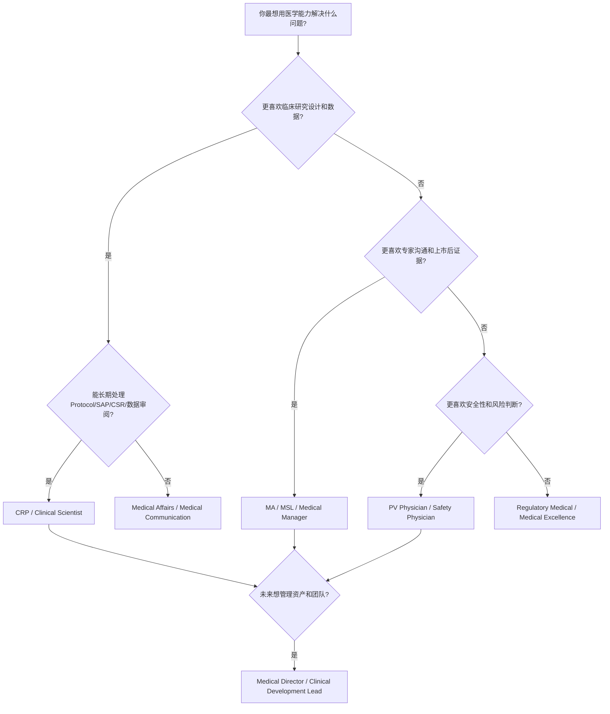

id: career-navigator

# Career Navigator：从医生到药企医学岗位的职业决策树

## 先回答一个核心问题

职业转型不是“哪个岗位更高级”，而是“你的优势、性格、风险偏好、生活方式、长期目标”与岗位任务是否匹配。临床医生常犯的错误是只看title：CRP、MA、MSL、Clinical Scientist、PV、Medical Director。真正该看的是：你每天愿意处理什么问题？你擅长深度数据还是人际影响？你能否接受频繁跨部门协作？你想靠医学判断成长，还是靠商业化影响力成长？

## 岗位决策树

## 横向比较：适合与不适合

| 岗位 | 适合什么人 | 不适合什么人 | 核心能力 | 成长空间 | AI替代风险 |
|---|---|---|---|---|---|
| CRP | 喜欢Protocol、数据、安全判断、跨职能研发 | 不喜欢文档、流程和长期细节 | Trial design, medical monitoring, data review | Clinical lead / Development lead | 低到中；判断和责任难替代 |
| Clinical Scientist | 喜欢研究设计、数据解读、文献和项目推进 | 只想做临床诊疗或专家关系 | Protocol, SAP, data interpretation | Clinical development strategy | 中；文档可辅助，策略难替代 |
| MA | 喜欢证据转化、KOL、医学策略、上市后问题 | 不喜欢沟通、不适应商业环境 | Medical strategy, communication, KOL insight | Medical Manager / Director | 中；内容生成可替代，洞察和影响力难替代 |
| MSL | 喜欢外勤、专家沟通、学术交流 | 不喜欢出差、不擅长关系维护 | Scientific exchange, KOL mapping | Field medical lead / MA | 中；标准问答可替代，专家信任难替代 |
| PV Physician | 喜欢风险判断、个案、信号、法规时限 | 不喜欢重复病例和高责任压力 | Causality, signal detection, safety writing | Safety lead / PV head | 低到中；自动化强，但医学责任仍需人 |
| Medical Director | 喜欢战略、资源、团队、跨部门影响 | 只想做个人专家、不愿承担业务结果 | Strategy, leadership, evidence, governance | BU medical head / CMO path | 低；高阶判断和组织影响难替代 |

## 裁员风险与行业地位

CRP和PV通常与研发管线强相关，管线调整会影响岗位稳定性，但核心医学判断能力可迁移。MA和MSL与上市产品和商业周期强相关，产品生命周期、组织架构和合规环境会影响岗位数量。Medical Director风险来自“战略价值是否可见”：如果只做审批材料或会议出席，容易被边缘化；如果能连接证据、KOL、商业、监管和生命周期，组织价值更高。

## Career Decision Layer：为什么有些医生适合MA，有些不适合？

医生适合MA的原因不是“懂临床”，而是医生天然理解患者路径、治疗决策、指南改变、KOL语言和真实世界执行难点。一个乳腺外科医生看到TNBC ADC数据时，会本能地问：这个患者在几线？之前用过IO吗？有没有脑转移？PD-L1和HER2-low怎么检测？毒性会不会影响后续手术或放疗？这些问题正是Medical Affairs最需要的临床洞察。

但并不是所有医生都适合MA。第一类不适合的是只习惯一对一诊疗、不愿意做跨部门协作的人。MA每天需要和市场、准入、研发、PV、Regulatory、MSL、销售培训、合规团队沟通，很多工作不是“我判断对了就结束”，而是要推动组织形成一致行动。第二类不适合的是只想做专家权威、不愿意接受商业环境的人。MA必须理解商业目标，但不能被商业目标绑架；这需要成熟边界感。第三类不适合的是只会讲临床经验、不愿意读Protocol、CSR、SAP、标签和竞品数据的人。药企医学岗位需要证据语言，不只是经验语言。

为什么博士通常比硕士更容易进入MA或CRP？不是学历本身有魔力，而是博士训练通常带来三种信号：文献阅读和问题拆解能力、研究设计和发表经验、在不确定问题中持续推进的能力。对肿瘤药企来说，博士背景还能帮助候选人理解机制、转化研究、biomarker和publication。但博士也有风险：如果表达过于学术、不了解商业环境、不能把复杂问题转成行动建议，反而会显得“不接地气”。硕士或本科医生也可以进入MA，关键是补足证据解读、英文沟通、项目管理和KOL洞察能力，并用作品集证明自己能输出。

## 为什么有人从MA转CRP？为什么有人从CRP转MA？

MA转CRP通常发生在三种情况。第一，个人更喜欢研究设计、数据和Protocol，不喜欢频繁外部沟通。第二，想从上市后证据和KOL洞察进入更早期临床开发，参与资产从Phase I到注册的全过程。第三，所在产品生命周期进入成熟期，MA工作变得偏执行，个人希望获得更强研发核心能力。MA转CRP的难点在于：需要补Protocol、SAP、medical monitoring、safety review、data review和法规流程，不能只靠KOL经验。

CRP转MA也很常见。第一，CRP积累了研究设计和数据解释能力后，希望更靠近市场、KOL和上市后策略。第二，有些医生发现自己不喜欢长期文档和数据清理，更喜欢沟通、培训和医学策略。第三，当产品进入上市期，懂研发证据的CRP转MA可以成为非常强的Medical Strategy人才。CRP转MA的难点在于：不能只用研发语言说话，要学会把证据转化成医生决策、KOL问题、publication plan、RWE计划和商业可理解的医学价值。

## 未来10年哪个岗位更稳？

没有绝对稳定岗位，只有更可迁移的能力。AI会替代一部分文献初筛、摘要生成、标准问答、医学写作初稿和数据可视化，但很难替代对复杂证据的责任判断、跨部门影响、KOL信任和监管风险取舍。未来更稳的人不是某个title，而是具备“四合一能力”的人：能读懂临床开发证据，能理解Medical Affairs应用，能判断Reviewer风险，能把竞品和商业格局转成医学策略。

CRP的稳定性来自研发核心流程，但受管线成败影响。MA的稳定性来自上市产品和商业组织，但受产品生命周期影响。PV的稳定性来自法规刚需，但工作可能更流程化。Clinical Scientist的稳定性取决于是否能从文档执行升级为开发策略。Medical Director最不容易被AI替代，但也最容易被组织结果评价：如果不能影响证据、KOL、策略和团队，就只是高级title。

对乳腺外科博士后、TNBC方向、ADC兴趣、不喜欢基础科研、希望离开医院的人，优先路线通常不是直接追Medical Director，而是先选择能最大化临床和研究复合优势的入口：MA、CRP或Clinical Scientist。若性格偏外向、喜欢专家沟通和策略，可优先MA；若喜欢方案、数据和研发流程，可优先CRP/Clinical Scientist；若想未来做Medical Director，最好的路径是先在一个资产上完成从证据解读、KOL洞察、研究建议、publication到生命周期策略的闭环。

## 选择规则

1. 如果你最强的是临床研究、终点、方案和安全，优先CRP/Clinical Scientist。
2. 如果你最强的是专家沟通、数据转译和上市后证据，优先MA/MSL。
3. 如果你最强的是严谨、风险、法规时限和个案判断，优先PV。
4. 如果你想长期做管理，不要只追title，先建立一个“可被组织依赖的战略能力”：证据判断、竞品判断、KOL判断、风险判断。

## Medical Affairs Application

MA候选人可用本页判断自己是否真的适合MA，而不是只是想离开医院。Medical Manager可用它设计团队人才梯队。Medical Director可用它判断候选人是“专家型”“策略型”还是“执行型”。

## 交叉链接

[[Career Match Assessment]]、[[Gap Analysis Engine]]、[[Medical Affairs Interview]]、[[Personal Strategy]]
