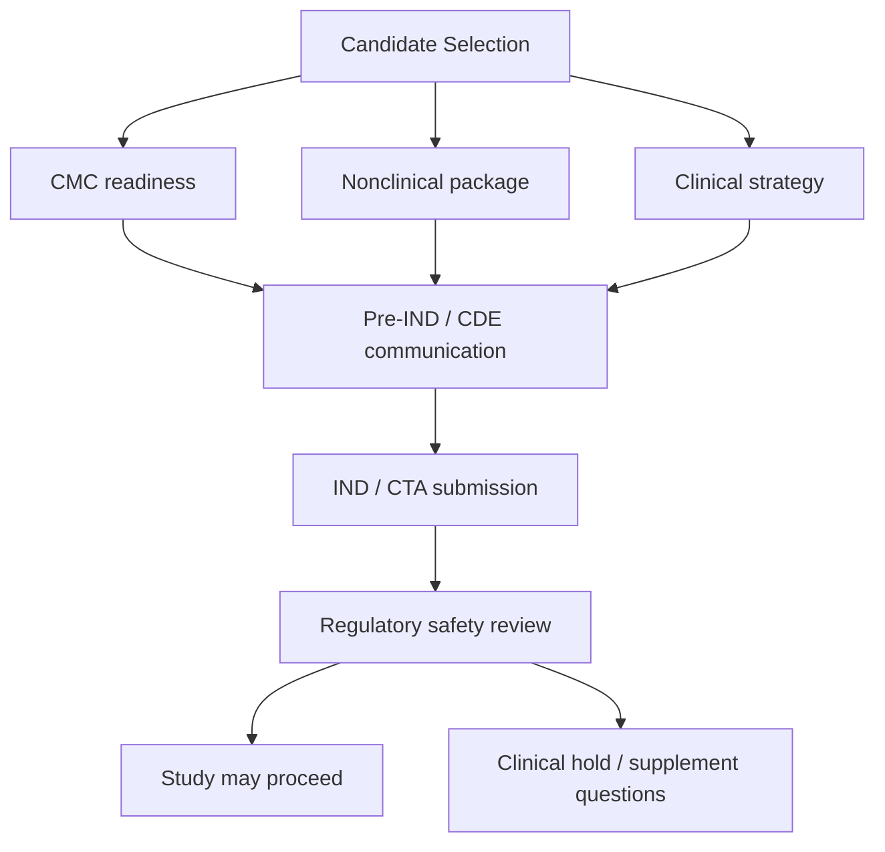

id: drug-stage-ind-cta

# IND / CTA：从非临床证据到临床试验许可

## 一句话理解

Investigational New Drug application（IND，研究性新药申请）或 Clinical Trial Application（CTA，临床试验申请）是 Sponsor 向监管机构证明“可以在人身上开始研究”的监管包。

## IND package 的三大支柱

IND/CTA 通常由 Chemistry, Manufacturing and Controls（CMC，化学/生产/质量控制）、Nonclinical（非临床）和 Clinical（临床）三部分支撑。CMC证明研究药物可被稳定、可控、可追溯地生产；Nonclinical证明已有足够药理和安全性依据；Clinical说明拟开展研究的设计、风险控制、受试者保护和医学合理性。

CRP最相关的是 Clinical Protocol（临床试验方案）、Investigator Brochure（IB，研究者手册）、Informed Consent Form（ICF，知情同意书）和 Safety Monitoring Plan（安全监测计划）。但CRP不能只看临床文件，因为临床方案中的起始剂量、DLT、监测项目、停药标准往往来自CMC和非临床风险。

## FDA IND流程

美国 FDA IND 提交通常包含 pre-IND meeting（IND前沟通会议）、正式提交、30-day safety review（30天安全审评）。如果 FDA 在30天内未发 clinical hold（临床暂停），研究可启动。FDA关注的问题非常实用：起始剂量是否合理？FIH风险是否可控？药物质量是否支持临床使用？方案是否保护受试者？是否有足够安全随访？是否存在不可接受风险？

Pre-IND meeting 的价值在于提前对齐关键问题：非临床包是否充分、起始剂量策略、FIH设计、是否需要额外毒理或CMC资料、目标人群是否合理。CRP可参与准备 briefing book（会议资料包）中的临床章节和问题清单。

## NMPA/CDE IND流程

中国 NMPA/CDE 的临床试验申请重视药学、非临床和临床整体证据链。沟通交流会议可用于讨论关键开发问题。CDE常见关注包括：中国受试者风险、已有境外数据可外推性、MRCT（Multi-Regional Clinical Trial，多区域临床试验）中国人群安排、伴随诊断、药学质量一致性、安全性风险控制和方案可执行性。

对于跨国项目，CRP要特别关注 China strategy（中国策略）：是否同步加入全球FIH或扩展队列？是否需要中国单独PK或剂量确认？中国临床实践与全球标准治疗是否一致？对照治疗在中国是否可及？这些都会影响后续注册桥接。

## 常见发补问题

1. 起始剂量依据不足，未解释NOAEL/MABEL选择。
2. 非临床毒性靶器官未转化为临床监测。
3. IB对风险描述不完整或与方案不一致。
4. CMC批次信息不足，稳定性数据不充分。
5. 入排标准不能有效保护高风险患者。
6. DLT定义不清，剂量递增规则不可执行。
7. 肿瘤患者后续治疗、随访和死亡收集计划不充分。

## Sponsor准备过程

Sponsor准备IND/CTA不是把各部门文件拼起来，而是形成一致的 benefit-risk narrative（获益-风险叙事）：为什么这个药值得进入人体，风险从哪里来，如何监测和缓解，早期研究如何回答关键问题。CRP应帮助团队把科学假设写成临床语言：目标适应证、研究目的、人群、终点、安全性管理和后续开发路径。

## 完整流程图

## 关键文件示例

| 文件 | 作用 | CRP重点 |
|---|---|---|
| Protocol | 描述研究如何执行 | 人群、剂量、终点、安全监测、停药规则 |
| IB | 汇总药物已有资料 | 风险一致性、非临床信号、临床风险说明 |
| ICF | 告知受试者风险获益 | 风险是否通俗、是否完整、是否与方案一致 |
| Pharmacy Manual | 药物管理 | 储存、配置、给药、偏差处理 |
| Safety Plan | 安全管理 | SAE、AESI、DLT、快速上报流程 |

## 面试考点

**问题：IND申请中CRP最需要关注什么？**  
优秀回答：我会重点看临床方案和IB是否准确反映非临床风险，起始剂量和剂量递增是否有依据，DLT和停止规则是否可执行，安全监测是否覆盖毒性靶器官，以及ICF是否充分告知受试者。

## 小测验

1. 判断题：IND通过代表药物已证明有效。答案：错，只代表可在可控风险下开展人体研究。
2. 单选题：FDA IND通常有多长安全审评期？A 7天 B 30天 C 6个月 D 1年。答案：B。
3. 判断题：IB与Protocol风险描述不一致可能成为监管问题。答案：对。
