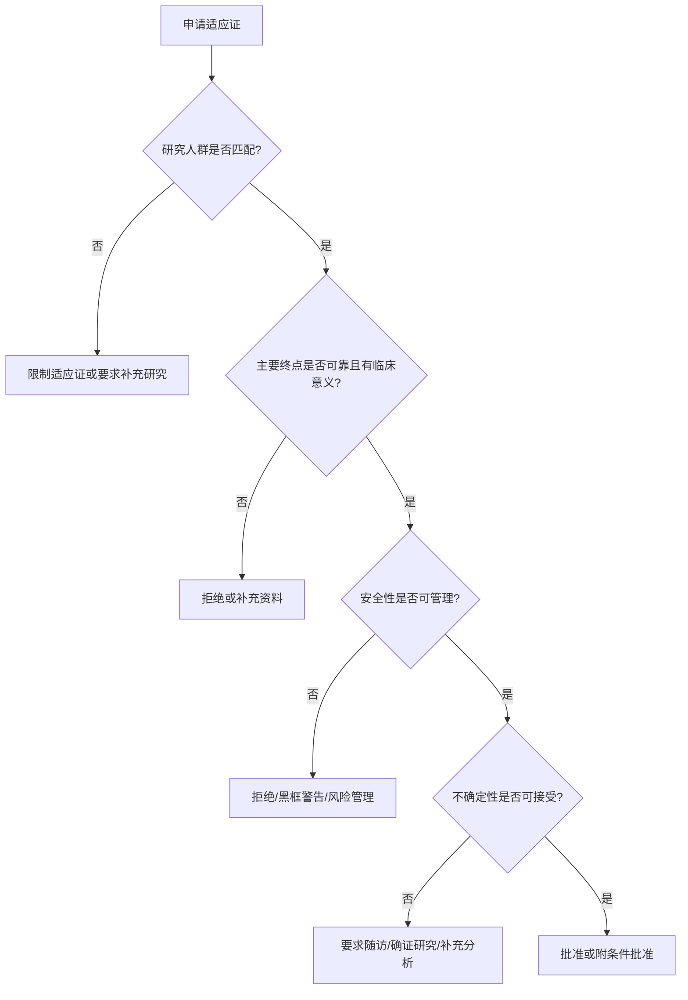

id: reviewer-benefit-risk

# Benefit-Risk Framework & Approval Decision Tree

## 学习目标

本页不是审评概念总结，而是训练你像Reviewer一样做批准判断。CRP在Sponsor内部最容易犯的错误，是只看到“疗效阳性”或“医学需求高”，却没有系统评价证据可靠性、终点临床意义、安全性可管理性、标签边界和上市后不确定性。Reviewer Academy 的核心能力是：同一份数据，能同时写出Sponsor观点和Reviewer观点，并能预测最终监管决策。

## Benefit-Risk Framework

| 维度 | Reviewer问题 | CRP准备材料 |
|---|---|---|
| Disease context | 疾病严重吗？现有治疗够不够？ | 流行病学、治疗格局、指南、真实世界需求 |
| Benefit | 疗效大小是否有临床意义？ | ORR、DoR、PFS、OS、pCR/EFS、PRO、亚组 |
| Risk | 毒性严重吗？可逆吗？可管理吗？ | AE/SAE、AESI、死亡、停药、减量、风险算法 |
| Uncertainty | 数据哪里不确定？ | OS成熟度、单臂偏倚、缺失、亚组、外推 |
| Risk mitigation | 风险能否控制？ | 标签、RMP、监测、教育、上市后研究 |
| Regulatory fit | 终点是否支持路径？ | 常规批准、加速批准、附条件批准、补充资料 |

## Approval Decision Tree

## 30个审评案例

### 案例1：单臂ORR高，DoR足够长

**Sponsor观点**：后线罕见肿瘤无标准治疗，ORR 58%，中位DoR 14个月，安全性可控，支持加速批准。  
**Reviewer观点**：单臂设计存在选择偏倚，但疗效大小超过历史治疗，DoR支持临床意义。  
**最终决策**：加速批准。  
**为什么批准**：严重疾病、未满足需求、ORR高且持久、安全可管理。  
**为什么可能拒绝**：如果DoR短、独立评审缺失或安全性数据库太小。

### 案例2：单臂ORR高但DoR短

**Sponsor观点**：ORR 45%显示明确抗肿瘤活性。  
**Reviewer观点**：DoR仅2.8个月，患者可能没有持久获益。  
**最终决策**：补充随访或拒绝当前申请。  
**为什么批准**：仅在无治疗选择且毒性低时可能限制批准。  
**为什么拒绝**：缓解不持久，临床获益不充分。

### 案例3：PFS阳性，OS未成熟

**Sponsor观点**：PFS HR 0.62，绝对改善4个月，OS数据未成熟但方向有利。  
**Reviewer观点**：PFS需确认评估一致、缺失少、BICR支持，OS无不利趋势。  
**最终决策**：可能常规批准或要求OS随访承诺。  
**为什么批准**：PFS改善大且安全性可接受。  
**为什么拒绝**：OS方向不利或PFS受偏倚影响。

### 案例4：PFS阳性但OS阴性

**Sponsor观点**：PFS改善是患者获益，OS受交叉和后续治疗影响。  
**Reviewer观点**：OS HR接近或超过1时需谨慎，尤其毒性增加时。  
**最终决策**：补充分析或限制适应证。  
**为什么批准**：PFS获益大、安全性好、OS无明确伤害。  
**为什么拒绝**：OS不利且毒性重。

### 案例5：OS阳性但毒性显著

**Sponsor观点**：OS延长2.5个月，满足硬终点。  
**Reviewer观点**：治疗相关死亡、严重AE和生活质量下降是否抵消OS获益？  
**最终决策**：批准但加强警示，或限制高危人群。  
**为什么批准**：OS是强获益，疾病严重。  
**为什么拒绝**：获益小且致死风险不可控。

### 案例6：pCR改善，EFS未成熟

**Sponsor观点**：新辅助TNBC pCR绝对提高14%，支持早期批准。  
**Reviewer观点**：pCR可支持早期信号，但需EFS随访和安全性对手术影响。  
**最终决策**：可能批准并要求EFS随访。  
**为什么批准**：高危早期疾病、pCR改善有既往关联。  
**为什么拒绝**：毒性影响手术或EFS方向不利。

### 案例7：EFS阳性但pCR不改善

**Sponsor观点**：EFS更接近长期获益，应优先考虑。  
**Reviewer观点**：若EFS成熟可靠，pCR不一致不一定否定。  
**最终决策**：可能批准。  
**为什么批准**：EFS是临床事件终点。  
**为什么拒绝**：事件定义不清或随访不足。

### 案例8：亚组获益不一致

**Sponsor观点**：总体阳性，亚组样本小，不应过度解读。  
**Reviewer观点**：若无获益亚组有生物学解释，标签可能限制。  
**最终决策**：限制适应证或要求补充分析。  
**为什么批准**：总体稳健且无交互证据。  
**为什么拒绝**：获益仅来自小亚组且非预设。

### 案例9：中国样本量不足

**Sponsor观点**：全球MRCT总体阳性，中国亚组方向一致。  
**Reviewer观点**：中国样本少、CI极宽，外推不确定。  
**最终决策**：要求补充中国数据或上市后研究。  
**为什么批准**：PK、安全性和亚洲亚组一致。  
**为什么拒绝**：中国标准治疗不同且亚组方向不一致。

### 案例10：对照治疗落后

**Sponsor观点**：研究启动时对照合理。  
**Reviewer观点**：提交时标准治疗已变化，结果不代表当前实践。  
**最终决策**：补充间接比较或新研究。  
**为什么批准**：目标人群仍无可及替代治疗。  
**为什么拒绝**：对照已不符合伦理和临床实践。

### 案例11：安全性数据库太小

**Sponsor观点**：疗效强，罕见病无法扩大太多。  
**Reviewer观点**：2例治疗相关死亡足以改变风险判断。  
**最终决策**：补充安全性或限制使用。  
**为什么批准**：疾病致死且风险可监测。  
**为什么拒绝**：严重风险频率无法估计。

### 案例12：ILD风险

**Sponsor观点**：ILD发生率可通过监测和停药管理。  
**Reviewer观点**：需看Grade 3以上、死亡、识别时间和处理算法。  
**最终决策**：批准附警示或要求RMP。  
**为什么批准**：疗效显著且ILD低频可控。  
**为什么拒绝**：致死ILD高且无预测方法。

### 案例13：Hy's Law信号

**Sponsor观点**：肝损伤病例有合并用药。  
**Reviewer观点**：必须逐例评估ALT、AST、bilirubin、ALP和替代病因。  
**最终决策**：补充资料或暂停。  
**为什么批准**：替代病因充分且监测可控。  
**为什么拒绝**：符合Hy's Law且疗效有限。

### 案例14：Biomarker检测不一致

**Sponsor观点**：总体人群阳性，检测可后续优化。  
**Reviewer观点**：如果标签依赖biomarker，检测必须可靠。  
**最终决策**：限制经验证检测方法。  
**为什么批准**：检测验证充分。  
**为什么拒绝**：cutoff不稳定导致患者选择错误。

### 案例15：外部对照

**Sponsor观点**：罕见病无法随机，外部对照显示明显优于自然史。  
**Reviewer观点**：可比性、终点定义和缺失数据是关键。  
**最终决策**：支持性接受或要求前瞻验证。  
**为什么批准**：效果极大且偏倚不足以解释。  
**为什么拒绝**：外部对照不可比。

### 案例16：RWE扩展适应证

**Sponsor观点**：真实世界样本更接近临床实践。  
**Reviewer观点**：RWD质量、偏倚控制、终点定义决定可用性。  
**最终决策**：作为支持证据。  
**为什么批准**：高质量前瞻登记且结果一致。  
**为什么拒绝**：回顾性缺失严重。

### 案例17：缺失数据过多

**Sponsor观点**：敏感性分析仍方向一致。  
**Reviewer观点**：缺失是否与疗效/毒性相关？  
**最终决策**：补充分析。  
**为什么批准**：缺失随机且不影响结论。  
**为什么拒绝**：信息性删失改变结果。

### 案例18：剂量未优化

**Sponsor观点**：III期使用RP2D且疗效阳性。  
**Reviewer观点**：高减量率提示剂量可能过高。  
**最终决策**：要求剂量优化研究或标签减量。  
**为什么批准**：剂量调整后仍有效。  
**为什么拒绝**：推荐剂量不可耐受。

### 案例19：DMC早停

**Sponsor观点**：疗效越界，应尽快上市。  
**Reviewer观点**：早停可能夸大效应，安全随访不足。  
**最终决策**：批准并要求长期随访。  
**为什么批准**：效应大且统计规则预设。  
**为什么拒绝**：早停非预设或数据不成熟。

### 案例20：主要终点失败，次要终点阳性

**Sponsor观点**：OS阳性比PFS更重要。  
**Reviewer观点**：如果OS在层级检验中未受保护，统计解释受限。  
**最终决策**：通常不能直接批准。  
**为什么批准**：罕见情况下OS非常强且一致。  
**为什么拒绝**：多重性失控。

### 案例21：探索性亚组阳性

**Sponsor观点**：生物学合理，值得标签限制到该人群。  
**Reviewer观点**：探索性结果需要验证。  
**最终决策**：要求新研究。  
**为什么批准**：若预设且强交互。  
**为什么拒绝**：数据挖掘风险。

### 案例22：PRO改善但PFS不改善

**Sponsor观点**：患者症状改善有价值。  
**Reviewer观点**：PRO可支持标签，但通常不足以单独证明抗肿瘤获益。  
**最终决策**：不支持抗肿瘤适应证。  
**为什么批准**：症状控制适应证且工具验证充分。  
**为什么拒绝**：缺乏疾病控制证据。

### 案例23：安全性优于对照但疗效非劣

**Sponsor观点**：非劣效且毒性更低，满足临床需求。  
**Reviewer观点**：非劣界值、检验灵敏度和对照稳定性必须成立。  
**最终决策**：可能批准。  
**为什么批准**：疗效保留且安全优势明确。  
**为什么拒绝**：界值过宽。

### 案例24：等效研究

**Sponsor观点**：新药疗效等效且给药便利。  
**Reviewer观点**：等效界值需临床和统计双重合理。  
**最终决策**：取决于界值和证据。  
**为什么批准**：等效证明严谨且有便利性。  
**为什么拒绝**：样本量不足。

### 案例25：伴随诊断未同步

**Sponsor观点**：药物疗效强，检测可上市后补。  
**Reviewer观点**：没有可靠检测就无法正确选择患者。  
**最终决策**：延迟或限制批准。  
**为什么批准**：已有验证检测可用。  
**为什么拒绝**：检测不可执行。

### 案例26：药物相互作用风险

**Sponsor观点**：肿瘤患者合并用药复杂，标签限制即可。  
**Reviewer观点**：强CYP抑制/诱导影响暴露和毒性，需要数据。  
**最终决策**：补充DDI或标签限制。  
**为什么批准**：风险可通过禁忌和监测控制。  
**为什么拒绝**：暴露风险不可预测。

### 案例27：免疫复治策略

**Sponsor观点**：部分患者停药后进展可rechallenge。  
**Reviewer观点**：复治疗效和irAE复发风险需独立证据。  
**最终决策**：不写入标签或作为探索。  
**为什么批准**：前瞻复治队列支持。  
**为什么拒绝**：证据不足。

### 案例28：Post-IO人群开发

**Sponsor观点**：仍有未满足需求。  
**Reviewer观点**：机制需解释为何既往IO失败后仍获益。  
**最终决策**：需要明确人群和终点。  
**为什么批准**：随机研究显示获益。  
**为什么拒绝**：单臂信号不可解释。

### 案例29：Post-ADC人群

**Sponsor观点**：新ADC payload不同，可克服耐药。  
**Reviewer观点**：需证明既往ADC暴露后的真实活性。  
**最终决策**：要求专门队列。  
**为什么批准**：post-ADC队列ORR/DoR强。  
**为什么拒绝**：混入ADC-naive患者。

### 案例30：标签适应证过宽

**Sponsor观点**：总体研究支持广泛人群。  
**Reviewer观点**：入组排除了脑转移、肝肾损害或特定治疗线，标签不能无限外推。  
**最终决策**：限制适应证或补充特殊人群信息。  
**为什么批准**：证据覆盖目标人群。  
**为什么拒绝**：申请范围超出数据。
